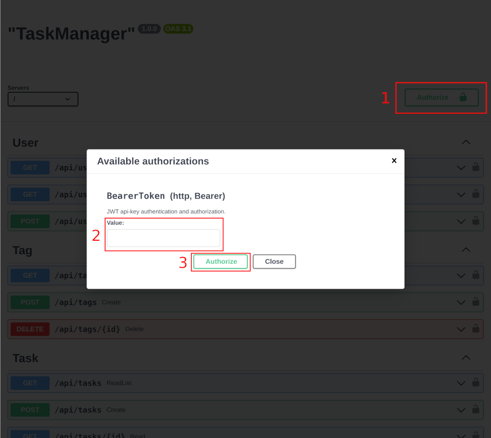

### Тестовое задание на позицию frontend middle разработчик

___
#### Желательный срок выполнения тестового задания **5 дней** с момента получения задания.
___

### Задача

Необходимо разработать одностраничный веб-сайт (SPA), в котором пользователь будет иметь возможность авторизации и управления своими задачами.

**Ссылка на макет:**
https://www.figma.com/file/CfVmmpwy2maej7kRRn0UaO/Task-Manager?type=design&node-id=0%3A1&mode=design&t=LessIPvMVbLtS2RS-1

---

**Исходники веб-сервера:**
https://github.com/nlabs-su/test-server

**Адрес веб-сервера:**
https://api.test-task.nlabs.su

**Документация OpenAPI:**
 - Swagger: https://api.test-task.nlabs.su/schema/swagger
 - Redoc: https://api.test-task.nlabs.su/schema/redoc
 - Elements: https://api.test-task.nlabs.su/schema/elements

_Веб-сервер общается с клиентом посредством REST API._

---

### Веб-сервер (API)

Для работы с пользователями необходимо сгенерировать 2 пользователя через API.

_Для этого откройте следующий адрес в браузере https://api.test-task.nlabs.su/api/users_.

**Сервер вернет логин и пароль пользователя, который в последствии необходимо будет использовать для авторизации в защищенных эндпоинтах.**

### Внимание! Генерируйте не более 5-ти пользователей.
---

Чтобы пользоваться защищенными эндпоинтами в документации OpenAPI сделайте следующее:

1. Получите JWT-токен после успешной авторизации пользователя ("/user/login");
2. Скопируйте значение ключа 'token' из ответа сервера;
3. Нажмите на кнопку (1) Authorize;
4. Вставьте JWT-токен в поле (2);
5. Нажмите на кнопку (3) Authorize;
6. Закройте модальное окно.

Теперь защищенные эндпоинты будут доступны, так как OpenAPI будет отправлять в заголовках токен авторизации.

---

### Требования
 - Веб-сайт должен иметь следующие страницы:
   - Авторизация (/login);
   - Основная страница (/).
 - Передача адреса веб-сервера для взаимодействия с API должна осуществляться посредством использования переменной окружения;
 - В качестве сборщика модулей желательно использовать **webpack**;
 - Верстка должна быть **адаптивной**.

### Технические требования
 - **Node.js** версии выше 16.20;
 - Веб-сайт должен быть написан на **TypeScript**;
 - Основная библиотека **React** (v.18+);
 - Дополнительные библиотеки: **React Router**, **Axios**;
 - Библиотека состояний: желательно **MobX**, но можно и **React Redux**.

### Примечания
  - **Дизайн веб-сайта на ваше усмотрение. В Figma основной упор сделан на расположение элементов;**
  - Разрешено использовать библиотеки компонентов. Но желательно использовать что-то из: mantine, radix ui, ant.d;
  - Желательно использовать **React Context** для общения между компонентами;
  - Во время загрузки страницы необходимо показывать индикатор (loader);
  - Веб-сайт должен быть разработан на функциональных компонентах, с использованием **React Hooks**;
  - Пишите код таким образом, каким бы вы писали его на работе;
  - Написание автотестов будет плюсом.

### Функциональные требования

#### Запуск

При открытии веб-сайта необходимо перенаправлять пользователя на **основную страницу**, при условии, что пользователь авторизован.
Если пользователь не авторизован, то сайт должен перенаправлять на страницу **авторизации** (/login).
При неудачной авторизации выводить сообщение “**Неправильный логин или пароль**”.

#### Процесс авторизации

При успешной авторизации сервер возвращает JWT-токен (срок действия 1 месяц).

Далее с каждым запросом веб-сайт должен отправлять в заголовках (headers) JWT-токен.

`Authorization: Bearer <token>`

#### Выход из аккаунта

При выходе из аккаунта веб-сайт должен прекратить передавать в заголовках JWT-токен.

#### Основная страница

На основной странице необходимы следующие элементы:
  - Шапка сайта:
    - Заголовок основной страницы;
    - Пользовательское меню (по нажатию должен открываться **dropdown** список с возможностью выхода из аккаунта).
  - Календарь на неделю:
    - Кнопка переключения на предыдущую неделю;
    - Кнопка переключения на текущую неделю;
    - Кнопка переключения на следующую неделю;
    - Кнопка добавления новой задачи.

При отправке запросов на добавление/изменение/удаление задач необходимо оповещать пользователя с помощью всплывающих сообщений.

### Функционал календаря
  - Переключение между неделями;
  - Подсветка текущего дня в календаре;
  - Отображение задач;
  - Отображение полных данных задачи при нажатии на нее;
  - Добавление/изменение/удаление задачи.

### Дополнительные задания (указаны в порядке приоритета)
  - Перетаскивание задачи в любой из отображаемых дней недели (DnD).
  - Сортировка задач по дате добавления (timestamp), по типу (type) в порядке возрастания или убывания;
  - Работа с тегами в задаче;
__________________
*Дополнительные задания не обязательны для выполнения, но очень желательны.*

### Результат

Результат данного тестового задания следует опубликовать в любой сервис хранения кода (github, gitlab, bitbucket) в виде публичного репозитория с инструкцией по запуску проекта.

### Обратная связь

Если есть вопросы по тестовому заданию, то можно задать их в [telegram](https://t.me/dkubatin).

### На этом всё, желаем удачи!
